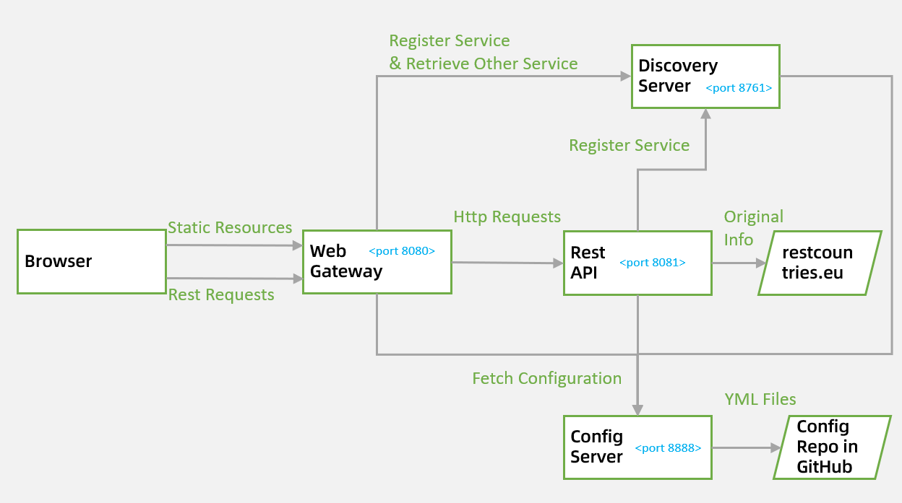
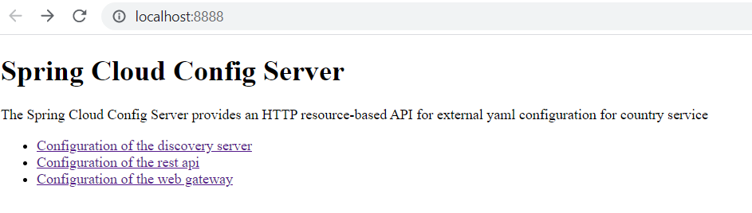
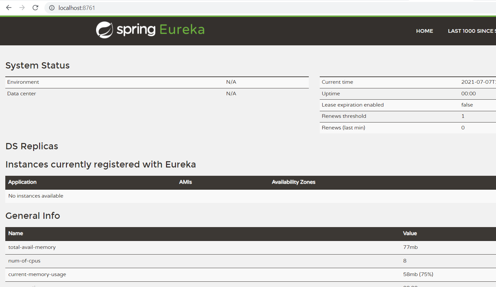
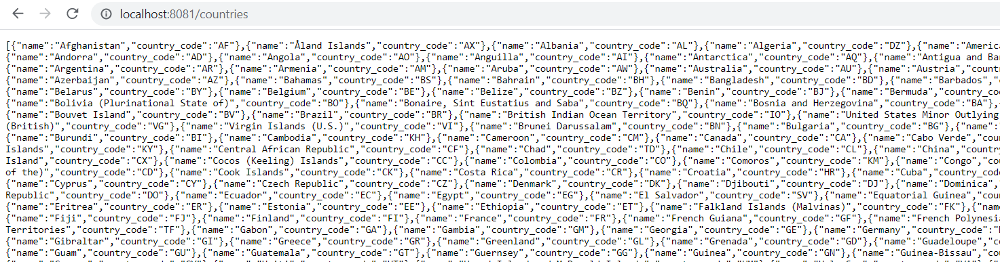
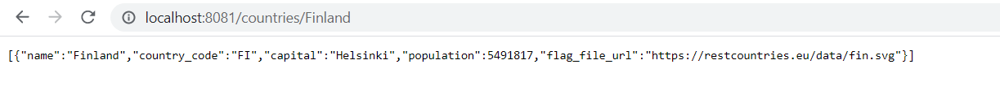
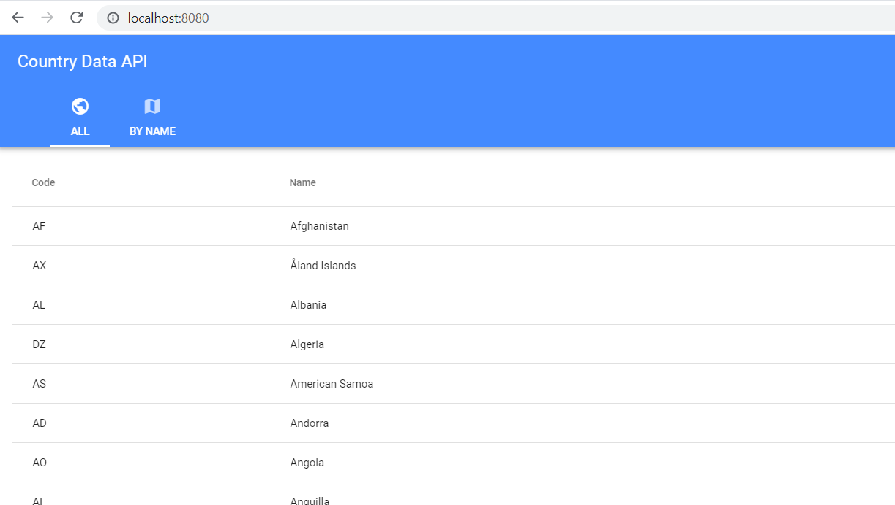
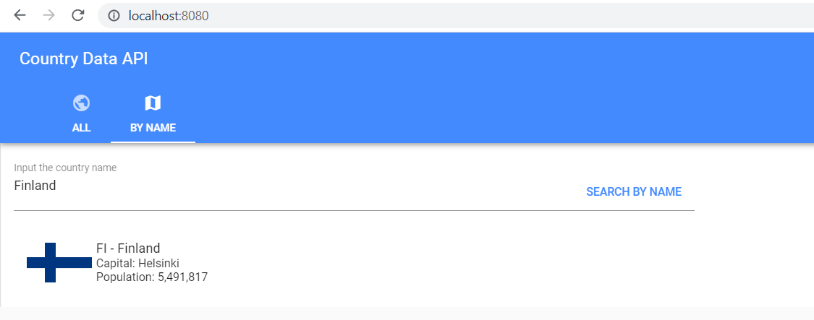

# COUNTRY-SERVICE
Implement a microservice which provides a list of countries and, in addition, provides more detailed information per country.

---

**For windows os:**

## Start the config server
In the root folder, run the command

`mvnw spring-boot:run -pl country-config-server`

The config server can be accessed in the following URL: 

[http://localhost:8888](http://localhost:8888)

## Start the discovery server
In the root folder, run the command

`mvnw spring-boot:run -pl country-discovery-server`

The discovery server can be accessed in the following URL: 

[http://localhost:8761](http://localhost:8761)

## Start the rest api server
In the root folder, run the command

`mvnw spring-boot:run -pl country-rest-api`

The rest api server can be accessed in the following URLs: 

GET /countries/ [http://localhost:8081/countries](http://localhost:8081/countries)

GET /countries/{name} [http://localhost:8081/countries/Finland](http://localhost:8081/countries/Finland)

## Start the web gateway server
In the root folder, run the command

`mvnw spring-boot:run -pl country-web-gateway`

The web gateway server can be accessed in the following URL: 

[http://localhost:8080](http://localhost:8080)

UI - list all countries

UI - search country by name

---

**For linux os please run the following scripts:**

`nohup ./mvnw spring-boot:run  -pl country-config-server &`

`nohup ./mvnw spring-boot:run -pl country-discovery-server &`

`nohup ./mvnw spring-boot:run -pl country-rest-api &`

`nohup ./mvnw spring-boot:run -pl country-web-gateway &`

Use command `ps -ef` and `kill {PID}` to stop the related processes.
